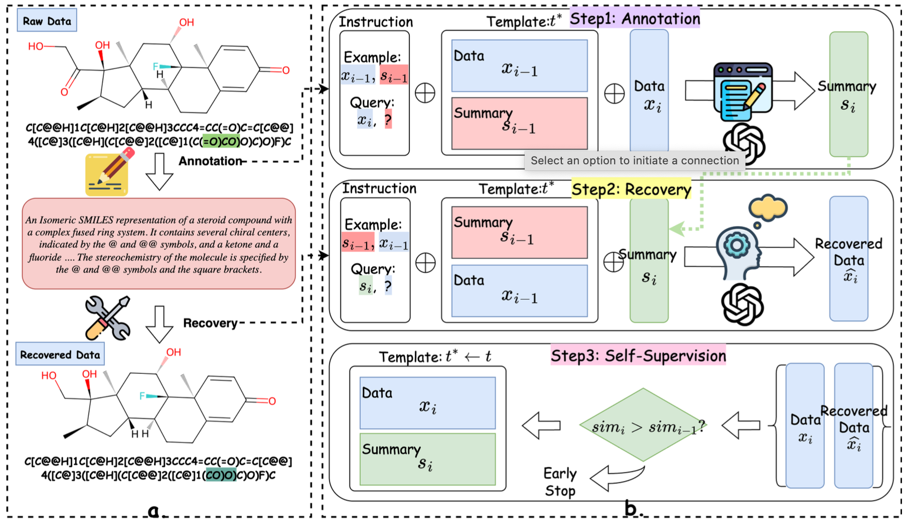
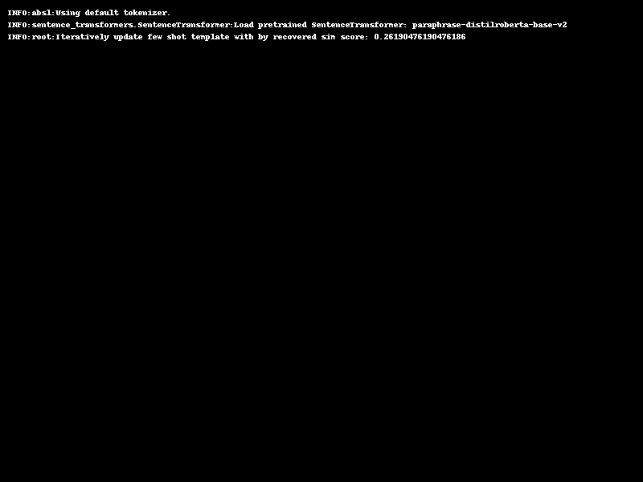

<h2 align="center"><a href="">📝 GPT Self-Supervision for an Efficient Data Annotator</a></h2>

## Core Idea: Iteratively swap the annotated objectives of (x, y); replace the template with one generated from data, which then self-refines based on the similarity score between cells.




Usage:

```bash
git clone https://github.com/TerryPei/Annotator.git
cd Annotator
```

Replace the API key in the prepare folder:

```bash
cd prepare
python encrypt_api_key.py
```

The APIs of OpenAI have been changed. When conducting the experiments, please reinstall the previous version '0.28.0':

```bash
pip install -U openai==0.28.0
```

One-Shot Stages:

```
python annotator.py
```

The correctly runing will output the log files like this:



Second stages:

Copy and paste the best template from the log file to generation python file, and run with 

```bash
cd generation
python run_generate_summary.py
```

The recovery evaluation score could be directly get via ```eval.py```.

The annotated dataset link https://drive.google.com/drive/folders/1MyxU1DE5hE5ANbDc3g8e4bSBVFQek5nH?usp=sharing.

## Citation

#### If this paper helps your research, we would appreciate your citation: 


```bibtex
@article{pei2023gpt,
  title={Gpt self-supervision for a better data annotator},
  author={Pei, Xiaohuan and Li, Yanxi and Xu, Chang},
  journal={arXiv preprint arXiv:2306.04349},
  year={2023}
}
```
